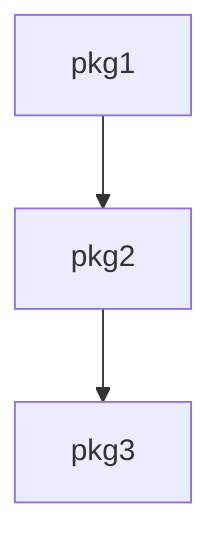

# /docs — Project Documentation Generator

Generate lightweight codebase docs for fast context ramp-up. Docs live in `/tmp/claude-docs/<project>/` — ephemeral, never committed.

## Usage

```
/docs              — Generate or refresh all docs for current project
/docs check        — Verify existing docs match codebase
/docs pkg <name>   — Generate/refresh a single package doc
```

## Output Structure

```
/tmp/claude-docs/<project>/
├── arch.md          # System overview (500 tokens max)
├── index.md         # Package routing table (300 tokens max)
└── pkg/
    └── <name>.md    # Per-package spec (1000 tokens max)
```

## Behavior

1. Determine `<project>` using: `_gc=$(git rev-parse --git-common-dir 2>/dev/null); if [ -n "$_gc" ] && [ "$_gc" != ".git" ]; then basename "$(cd "$_gc/.." && pwd)"; else basename "$(pwd)"; fi` — this resolves to the real repo name even inside a worktree
2. If `/tmp/claude-docs/<project>/` exists and is recent (< 24h), read and report. Otherwise regenerate.
3. Spawn sub-agents for each phase (orchestrator never generates content directly):
   - **Arch agent**: Explores top-level structure, entry points, package graph. Produces `arch.md` with mermaid diagram.
   - **Index agent**: Lists all packages/modules with one-line purpose. Produces `index.md` as a routing table.
   - **Pkg agents** (parallel): One per significant package. Each produces `pkg/<name>.md`.

## Meta-Thinking Requirement

Before writing any doc, agents MUST first produce a structural artifact to force deep understanding:
- `arch.md` agent: Draw a mermaid package dependency graph. Trace the main data flow.
- `pkg/<name>.md` agent: Draw a call graph of public functions. List state transitions if stateful.

These artifacts ARE the doc — mermaid diagrams go directly into the markdown.

## File Formats

### arch.md (500 tokens max)

```markdown
# Architecture

## System Flow
<one-line description of what the system does>

## Package Graph


## Data Flow
1. Entry point → ...
2. ... → ...
3. ... → Output

## Key Decisions
- Decision 1: rationale
- Decision 2: rationale
```

### index.md (300 tokens max)

```markdown
# Index

| Package | Purpose |
|---------|---------|
| pkg1 | One-line description |
| pkg2 | One-line description |
```

### pkg/<name>.md (1000 tokens max)

```markdown
# <name>

Purpose: <one line>

## Interface
Public functions, what they do (not how)

## Wiring
- Depends on: [packages]
- Used by: [packages]

## Expectations
- MUST: guaranteed behaviors
- NEVER: forbidden behaviors
- WHEN x THEN y: conditional behaviors

## Flows
Key paths through this package (mermaid or pseudocode)
```

## Token Discipline

- Every token costs context window
- Prefer tables over prose
- One fact per line
- No examples unless essential
- If a package is trivial (< 50 lines), skip the doc
- Delete > comment out

## Rules

- NEVER write to the actual repo — only `/tmp/claude-docs/`
- No speculation — if unsure about a package's purpose, read the code first
- Mermaid diagrams are mandatory for arch.md and encouraged for pkg docs
- Stale docs are worse than no docs — regenerate when codebase changes significantly
